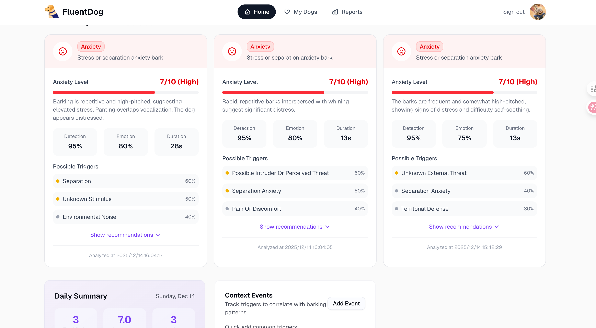
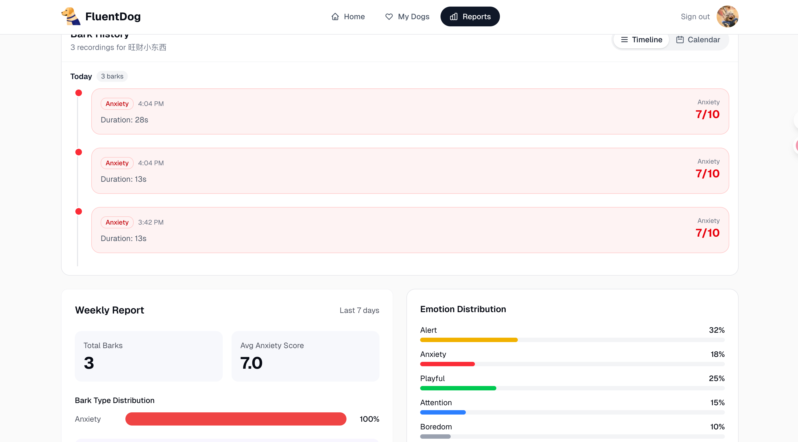

# FluentDog AI

AI-powered dog bark analysis platform that helps pet owners understand why their dogs bark and provides personalized training recommendations to reduce excessive barking.


## Features

### Bark Analysis
- **AI Emotion Classification**: Identifies 5 emotion types (Alert, Anxiety, Playful, Attention, Boredom)
- **Anxiety Scoring**: 1-10 scale with detailed rationale
- **Trigger Detection**: Identifies possible causes of barking with confidence scores
- **Follow-up Recommendations**: Context-aware questions to improve analysis



### Dashboard

Manage your dogs, upload bark recordings, and track analysis results all in one place. The dashboard provides a comprehensive overview of your dog's barking patterns with daily summaries, emotion trends, and personalized training recommendations.



- **Multi-step Dog Onboarding**: Gender, age, breed, and name wizard
- **Bark Upload/Recording**: Support for audio and video files
- **Timeline View**: Chronological bark history grouped by date
- **Calendar View**: Monthly overview with emotion indicators
- **Weekly Reports**: Emotion distribution and anxiety trends

### User Features
- **Supabase Authentication**: Email/password and OAuth support
- **Dog Management**: Add multiple dogs with profiles stored in database
- **Plan Tiers**: Free, Premium ($19.9/mo), Coach ($29.9/mo)
- **PayPal Integration**: Subscription payments

## Tech Stack

- **Framework**: Next.js 16 (App Router, Turbopack)
- **Language**: TypeScript
- **Styling**: Tailwind CSS
- **UI Components**: shadcn/ui
- **Database**: Supabase (PostgreSQL with RLS)
- **Authentication**: Supabase Auth
- **AI**: OpenRouter API (Google Gemini 2.0 Flash)
- **Payments**: PayPal SDK

## Getting Started

### Prerequisites

- Node.js 18+
- pnpm
- Supabase account
- OpenRouter API key

### Installation

```bash
# Clone the repository
git clone https://github.com/liuaibin001/fluentdog-ai.git
cd fluentdog-ai

# Install dependencies
pnpm install

# Copy environment variables
cp .env.example .env.local
```

### Environment Variables

Create a `.env.local` file with:

```env
# Supabase
NEXT_PUBLIC_SUPABASE_URL=your_supabase_url
NEXT_PUBLIC_SUPABASE_ANON_KEY=your_supabase_anon_key

# PayPal
NEXT_PUBLIC_PAYPAL_CLIENT_ID=your_paypal_client_id
PAYPAL_SECRET_KEY=your_paypal_secret
PAYPAL_MODE=sandbox

# OpenRouter (for Gemini bark analysis)
OPENROUTER_API_KEY=your_openrouter_api_key
```

### Database Setup

Run the Supabase migrations:

```sql
-- Create dogs table
CREATE TABLE dogs (
  id UUID DEFAULT gen_random_uuid() PRIMARY KEY,
  user_id UUID NOT NULL REFERENCES auth.users(id) ON DELETE CASCADE,
  name VARCHAR(100) NOT NULL,
  gender VARCHAR(10),
  breed VARCHAR(100),
  age VARCHAR(50),
  image_url TEXT,
  created_at TIMESTAMP WITH TIME ZONE DEFAULT NOW(),
  updated_at TIMESTAMP WITH TIME ZONE DEFAULT NOW()
);

-- Enable RLS
ALTER TABLE dogs ENABLE ROW LEVEL SECURITY;

-- RLS policies
CREATE POLICY "Users can view own dogs" ON dogs FOR SELECT USING (auth.uid() = user_id);
CREATE POLICY "Users can insert own dogs" ON dogs FOR INSERT WITH CHECK (auth.uid() = user_id);
CREATE POLICY "Users can update own dogs" ON dogs FOR UPDATE USING (auth.uid() = user_id);
CREATE POLICY "Users can delete own dogs" ON dogs FOR DELETE USING (auth.uid() = user_id);
```

### Development

```bash
# Start development server
pnpm dev

# Build for production
pnpm build

# Start production server
pnpm start
```

## Project Structure

```
fluentdog-ai/
├── app/
│   ├── api/
│   │   ├── analyze-bark/      # Bark analysis API (OpenRouter/Gemini)
│   │   └── paypal/            # PayPal payment endpoints
│   ├── auth/                  # Authentication callbacks
│   ├── blog/                  # Blog/guides pages
│   ├── checkout/              # Payment flow
│   ├── dashboard/             # Main dashboard
│   ├── login/                 # Login page
│   ├── signup/                # Signup page
│   └── page.tsx               # Landing page
├── components/
│   ├── dashboard/
│   │   ├── add-dog-dialog.tsx # Multi-step dog onboarding
│   │   ├── bark-analysis-card.tsx
│   │   ├── bark-history.tsx   # Timeline/Calendar views
│   │   ├── bark-upload.tsx    # Audio upload/recording
│   │   └── ...
│   ├── ui/                    # shadcn/ui components
│   └── ...
├── lib/
│   ├── services/
│   │   └── dogs.ts            # Dog CRUD operations
│   └── supabase/              # Supabase client
├── prompts/
│   ├── bark-analysis.en.md    # English analysis prompt
│   └── bark-analysis.zh.md    # Chinese analysis prompt
└── supabase/
    └── migrations/            # Database migrations
```

## API Endpoints

### POST /api/analyze-bark

Analyze dog bark audio using AI.

**Request:**
```json
{
  "audioBase64": "base64_encoded_audio",
  "mimeType": "audio/wav",
  "context": "optional context about the dog or situation"
}
```

**Response:**
```json
{
  "isDogBark": true,
  "dogBarkConfidence": 0.95,
  "emotionType": "anxiety",
  "emotionConfidence": 0.82,
  "anxietyScore": 7,
  "anxietyRationale": "Persistent barking with high frequency...",
  "triggerCandidates": [
    {
      "trigger": "separation",
      "confidence": 0.75,
      "rationale": "Pattern consistent with separation anxiety"
    }
  ],
  "needsMoreContext": true,
  "followUpQuestions": [
    "Was the dog home alone?",
    "How long has the barking persisted?"
  ]
}
```

## License

MIT

## Links

- [Live Demo](https://fluentdog.app)
- [Blog: How to Stop Dog Barking](https://fluentdog.app/blog/how-to-stop-dog-barking)

## Star History

[](https://www.star-history.com/#liuaibin001/fluentdog-ai&type=date&legend=top-left)


